## Ex-06-Feature-Transformation
## AIM:
     To read the given data and perform Feature Transformation process and save the data to a file.

## EXPLANATION:
      Feature Transformation is a technique by which we can boost our model performance. Feature transformation is a mathematical transformation in which we apply a mathematical formula to a particular column(feature) and transform the values which are useful for our further analysis.

## ALGORITHM:
## STEP 1:
Read the given Data

## STEP 2:
Clean the Data Set using Data Cleaning Process

## STEP 3:
Apply Feature Transformation techniques to all the features of the data set

## STEP 4:
Print the transformed features

## PROGRAM:
## NAME: B.PAVIZHI
## REG NO: 212221230077

## Importing Libraries
```
import numpy as np
import pandas as pd
import matplotlib.pyplot as plt
import statsmodels.api as sm
import scipy.stats as stats
from sklearn.preprocessing import QuantileTransformer
```
## Reading CSV File
```
df=pd.read_csv("/content/drive/MyDrive/Colab Notebooks/Semester 3/19AI403 _Intro to DS/Exp_6/Data_to_Transform.csv")
df
```
## Basic Process
```
df.head()

df.info()

df.describe()

df.tail()

df.shape

df.columns

df.isnull().sum()

df.duplicated()
```
## Before Transformation
```
sm.qqplot(df['Highly Positive Skew'],fit=True,line='45')
plt.show()

sm.qqplot(df['Highly Negative Skew'],fit=True,line='45')
plt.show()

sm.qqplot(df['Moderate Positive Skew'],fit=True,line='45')
plt.show()

sm.qqplot(df['Moderate Negative Skew'],fit=True,line='45')
plt.show()
```
## Log Transformation
```
df['Highly Positive Skew'] = np.log(df['Highly Positive Skew'])

sm.qqplot(df['Highly Positive Skew'],fit=True,line='45')
plt.show()


df['Moderate Positive Skew'] = np.log(df['Moderate Positive Skew'])

sm.qqplot(df['Moderate Positive Skew'],fit=True,line='45')
plt.show()
```
## Reciprocal Transformation
```
df['Highly Positive Skew'] = 1/df['Highly Positive Skew']

sm.qqplot(df['Highly Positive Skew'],fit=True,line='45')
plt.show()
```
## Square Root Transformation
```
df['Highly Positive Skew'] = df['Highly Positive Skew']**(1/1.2)

sm.qqplot(df['Highly Positive Skew'],fit=True,line='45')
plt.show()
```
## Power Transformation
```
df['Moderate Positive Skew_1'], parameters=stats.yeojohnson(df['Moderate Positive Skew'])

sm.qqplot(df['Moderate Positive Skew_1'],fit=True,line='45')
plt.show()


from sklearn.preprocessing import PowerTransformer
transformer=PowerTransformer("yeo-johnson")

df['ModerateNegativeSkew_2']=pd.DataFrame(transformer.fit_transform(df[['Moderate Negative Skew']]))

sm.qqplot(df['ModerateNegativeSkew_2'],fit=True,line='45')
plt.show()
```
## Quantile Transformation
```
from sklearn.preprocessing import QuantileTransformer
qt = QuantileTransformer(output_distribution = 'normal')

df['ModerateNegativeSkew_2'] = pd.DataFrame(qt.fit_transform(df[['Moderate Negative Skew']]))

sm.qqplot(df['ModerateNegativeSkew_2'],fit=True,line='45')
plt.show()
```
## OUTPUT:
## Reading CSV File
## df
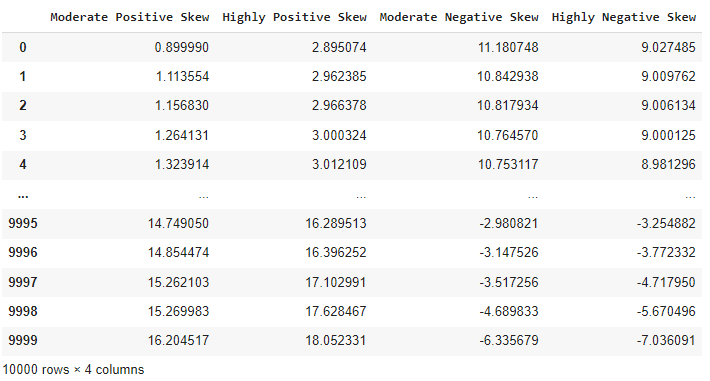

## Basic Process
## Head


## Info
.png)


## Describe
.png)


## Tail
.png)


## Shape
.png)


## Columns
.png)


## Null Values
.png)


## Duplicate Values
.png)


## Before Transformation
## Highly Positive Skew
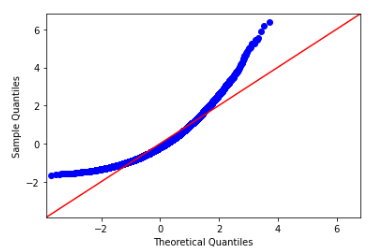

## Highly Negative Skew
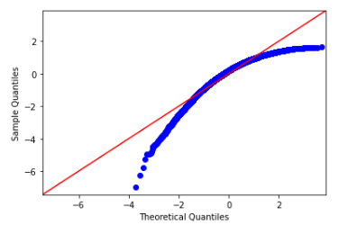

## Moderate Positive Skew
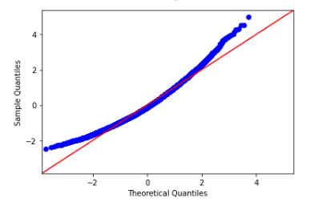

## Moderate Negative Skew
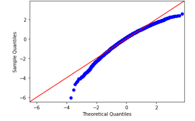

## Log Transformation
## Highly Positive Skew
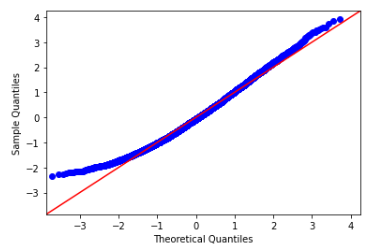

## Moderate Positive Skew

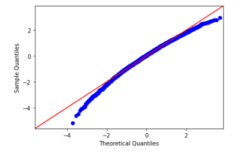
## Reciprocal Transformation
## Highly Positive Skew
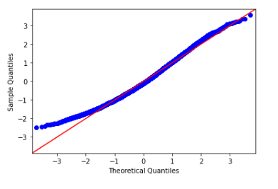

## Square Root Transformation
## Highly Positive Skew
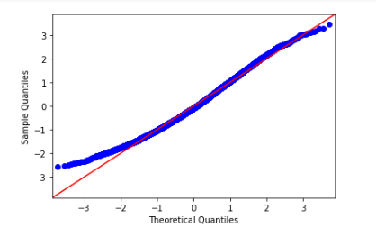

## Power Transformation
## Moderate Positive Skew


## Moderate Negative Skew

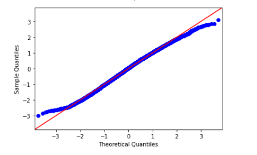
## Quantile Transformation
## Moderate Negative Skew

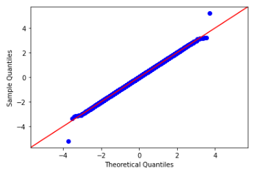
## RESULT:
     Thus feature transformation is done for the given dataset.